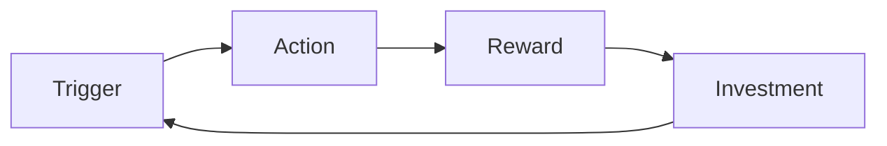

# Teardown: <product> — <date>

**Thesis (one sentence, answer first):**

## The arc
- Objective the company is optimising for:
- Binding constraint:
- Therefore the product's job right now is:

## 1. Context and objective function
## 2. Business model and economics
| Line | Value | Basis (measured / benchmarked / assumed) | Impact if wrong |
|---|---|---|---|

## 3. Market structure and competition
## 4. Users, segments and jobs
| Segment | Job to be done | Trigger | Current workaround | Switching cost |
|---|---|---|---|---|

## 5. Core loop and growth engine

Rate-limiting step and evidence:

## 6. Experience walkthrough
| Step | Friction | Cost to user | Metric affected | Charitable explanation |
|---|---|---|---|---|

Unhappy paths observed:

## 7. Opportunities
### O1 — <name>
- Hypothesis (falsifiable):
- Segment and loop step:
- Metric, baseline, expected magnitude (show arithmetic):
- Effort and dependencies:
- Risk and guardrail:
- One-way or two-way door:

### O2 —
### O3 —

## 8. Prioritisation and refusals
| Criterion | Weight | O1 | O2 | O3 |
|---|---|---|---|---|

Ranking and the assumption that would reorder it:

**What I would not build, and why:**

## 9. Measurement and pre-mortem
North star, tree, guardrail, decision rule:
Pre-mortem — three most likely causes of failure and the earliest signal for each:
Cheapest test that would kill the top idea in two weeks:

## Consistency checks
1-8 from teardown-layers.md: pass / fail with note

## 120-second version
